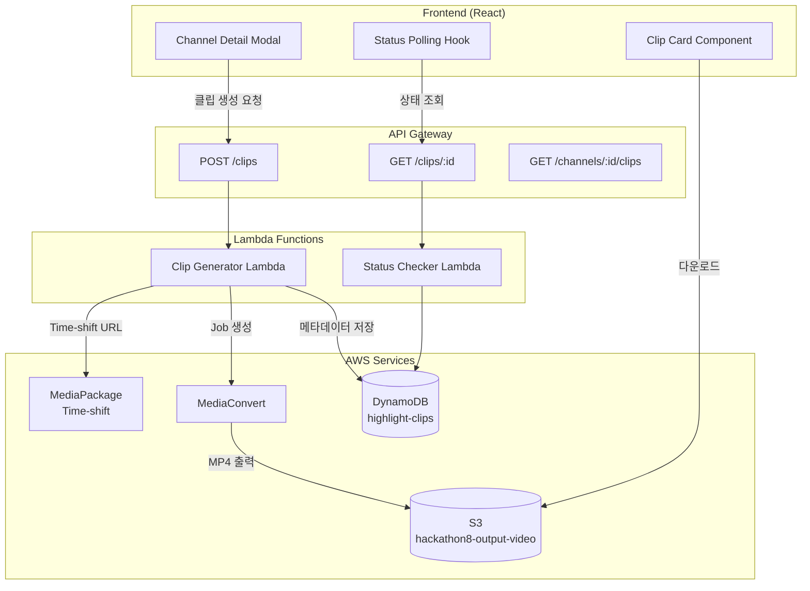

# Design Document: Highlight Clip Generation

## Overview

라이브 스포츠 방송 중 하이라이트 이벤트에서 비디오 클립을 생성하는 시스템입니다. MediaPackage의 Time-shift 기능과 AWS MediaConvert를 활용하여 HLS 스트림에서 MP4 클립을 추출합니다.

### Key Design Decisions

1. **Time-shift 기반 클립 추출**: MediaPackage의 Time-shift URL 파라미터를 사용하여 라이브 스트림의 과거 시점 영상에 접근
2. **비동기 처리**: MediaConvert Job은 비동기로 실행되며, 클라이언트는 폴링을 통해 상태를 확인
3. **상태 관리**: DynamoDB를 사용하여 클립 메타데이터와 상태를 저장
4. **기존 인프라 활용**: 현재 구현된 Lambda 함수와 API Gateway를 확장

## Architecture



## Components and Interfaces

### Frontend Components

#### ClipGeneratorButton
클립 생성을 트리거하는 버튼 컴포넌트

```typescript
interface ClipGeneratorButtonProps {
  event: SportEvent;
  channelId: string;
  onClipCreated: (clipId: string) => void;
  disabled?: boolean;
}
```

#### ClipStatusBadge
클립 생성 상태를 표시하는 배지 컴포넌트

```typescript
interface ClipStatusBadgeProps {
  status: ClipStatus;
  progress?: number;
}

type ClipStatus = 'PENDING' | 'PROCESSING' | 'COMPLETED' | 'FAILED';
```

#### ClipCard
생성된 클립을 표시하고 다운로드/미리보기 기능을 제공하는 카드 컴포넌트

```typescript
interface ClipCardProps {
  clip: Clip;
  onPreview: (clip: Clip) => void;
  onDownload: (clip: Clip) => void;
}
```

### API Interfaces

#### Create Clip Request
```typescript
interface CreateClipRequest {
  channelId: string;
  eventId: string;
  startPts: number;
  endPts: number;
  timescale: number;
  timestamp: number;  // 이벤트 발생 시점 (Unix timestamp)
  tags?: string[];
}
```

#### Create Clip Response
```typescript
interface CreateClipResponse {
  clipId: string;
  status: ClipStatus;
  message: string;
}
```

#### Clip Status Response
```typescript
interface ClipStatusResponse {
  clipId: string;
  status: ClipStatus;
  clipUrl?: string;
  thumbnailUrl?: string;
  error?: string;
  createdAt: number;
  updatedAt: number;
}
```

### Backend Services

#### Clip Generator Lambda
기존 `lambda/clip-generator/index.mjs`를 확장하여 API Gateway 트리거 지원

```typescript
// 입력 처리 로직
interface LambdaEvent {
  // API Gateway 요청
  httpMethod?: string;
  body?: string;
  pathParameters?: { clipId?: string };
  
  // CloudWatch Logs Subscription (기존)
  awslogs?: { data: string };
  
  // EventBridge (기존)
  detail?: object;
}
```

## Data Models

### Clip Entity (DynamoDB)

```typescript
interface ClipEntity {
  id: string;                    // Partition Key (UUID)
  channelId: string;             // GSI: channelId-timestamp-index
  eventId: string;               // 원본 이벤트 ID
  type: EventType;               // 이벤트 타입
  tags: string[];
  
  // Time 정보
  startPts: number;
  endPts: number;
  timescale: number;
  duration: number;              // 초 단위
  timestamp: number;             // Sort Key for GSI
  
  // 상태 정보
  status: ClipStatus;
  error?: string;
  
  // 출력 정보
  clipUrl?: string;
  thumbnailUrl?: string;
  
  // 메타데이터
  createdAt: number;
  updatedAt: number;
}
```

### Time-shift URL 구조

```
{base_hls_url}?start={ISO8601_start}&end={ISO8601_end}

예시:
https://xxx.mediapackage.us-west-2.amazonaws.com/out/v1/xxx/index.m3u8?start=2024-01-01T12:00:00Z&end=2024-01-01T12:00:30Z
```

### Time 계산 로직

```typescript
// PTS를 초 단위로 변환
const startSeconds = Math.floor(startPts / timescale);
const endSeconds = Math.ceil(endPts / timescale);
const duration = endSeconds - startSeconds;

// 이벤트 timestamp를 ISO 8601로 변환
const eventDate = new Date(timestamp);
const startTime = new Date(eventDate.getTime() - (duration * 1000));
const endTime = eventDate;

// Time-shift URL 파라미터
const startParam = startTime.toISOString();
const endParam = endTime.toISOString();
```


## Correctness Properties

*A property is a characteristic or behavior that should hold true across all valid executions of a system—essentially, a formal statement about what the system should do. Properties serve as the bridge between human-readable specifications and machine-verifiable correctness guarantees.*


### Property 1: 클립 생성 요청 파라미터 완전성

*For any* 클립 생성 요청, 필수 파라미터(startPts, endPts, channelId, timestamp)가 모두 포함된 경우에만 요청이 성공하고, 하나라도 누락된 경우 에러를 반환해야 한다.

**Validates: Requirements 1.1, 1.3**

### Property 2: 클립 ID 고유성

*For any* 성공적인 클립 생성 요청에 대해, 생성된 clipId는 기존의 모든 clipId와 중복되지 않아야 한다.

**Validates: Requirements 1.4**

### Property 3: Time-shift URL 형식 정확성

*For any* 유효한 timestamp와 PTS 값에 대해, 생성된 Time-shift URL은 ISO 8601 형식의 start/end 파라미터를 포함해야 하며, start는 end보다 이전 시점이어야 한다.

**Validates: Requirements 2.1, 2.2**

### Property 4: Time-shift 윈도우 범위 검증

*For any* 이벤트 timestamp가 현재 시점으로부터 24시간 이전인 경우, 클립 생성 요청은 에러를 반환해야 한다.

**Validates: Requirements 2.3**

### Property 5: 클립 상태 전이 일관성

*For any* 클립에 대해, 상태는 PENDING → PROCESSING → COMPLETED 또는 PENDING → PROCESSING → FAILED 순서로만 전이되어야 하며, 역방향 전이는 불가능해야 한다.

**Validates: Requirements 1.2, 3.2, 3.3, 3.4**

### Property 6: 클립 메타데이터 표시 완전성

*For any* COMPLETED 상태의 클립에 대해, 미리보기 시 이벤트 타입, 시간, 길이 메타데이터가 모두 표시되어야 한다.

**Validates: Requirements 6.2**

### Property 7: 일괄 클립 생성 요청 수 일치

*For any* N개의 이벤트가 선택된 일괄 클립 생성 요청에 대해, 정확히 N개의 개별 클립 생성 요청이 전송되어야 한다.

**Validates: Requirements 7.1**

### Property 8: 일괄 클립 상태 독립성

*For any* 일괄 클립 생성에서, 각 클립의 상태는 독립적으로 추적되어야 하며, 하나의 클립 실패가 다른 클립의 처리에 영향을 주지 않아야 한다.

**Validates: Requirements 7.2, 7.3**

### Property 9: 일괄 클립 진행률 정확성

*For any* 일괄 클립 생성 중, 진행률은 (완료된 클립 수 / 전체 클립 수) × 100으로 계산되어야 한다.

**Validates: Requirements 7.4**

## Error Handling

### Frontend Error Handling

| 에러 상황 | 처리 방법 |
|----------|----------|
| API 요청 실패 | Toast 알림으로 에러 메시지 표시, 재시도 버튼 제공 |
| 필수 파라미터 누락 | 버튼 비활성화, 툴팁으로 누락 정보 안내 |
| Time-shift 윈도우 초과 | 에러 메시지와 함께 클립 생성 불가 안내 |
| 다운로드 실패 | Toast 알림, 클립 상태를 FAILED로 업데이트 |
| 폴링 실패 | 자동 재시도 (최대 3회), 이후 수동 새로고침 안내 |

### Backend Error Handling

| 에러 상황 | HTTP 상태 | 응답 |
|----------|----------|------|
| 필수 파라미터 누락 | 400 | `{ error: "Missing required parameters", missing: [...] }` |
| Time-shift 윈도우 초과 | 400 | `{ error: "Event outside time-shift window" }` |
| MediaConvert Job 생성 실패 | 500 | `{ error: "Failed to create MediaConvert job" }` |
| 클립 조회 실패 | 404 | `{ error: "Clip not found" }` |
| S3 파일 없음 | 404 | `{ error: "Clip file not found in S3" }` |

## Testing Strategy

### Unit Tests

단위 테스트는 개별 함수와 컴포넌트의 동작을 검증합니다.

- **Time 계산 함수**: PTS → 초 변환, ISO 8601 형식 변환
- **URL 생성 함수**: Time-shift URL 파라미터 생성
- **상태 관리 훅**: useClipStatus 훅의 상태 전이
- **유효성 검사**: 필수 파라미터 검증 로직

### Property-Based Tests

속성 기반 테스트는 fast-check 라이브러리를 사용하여 다양한 입력에 대한 불변 속성을 검증합니다.

**테스트 설정**:
- 라이브러리: fast-check
- 최소 반복 횟수: 100회
- 태그 형식: `Feature: highlight-clip-generation, Property N: {property_text}`

**테스트 대상 속성**:
1. Property 1: 파라미터 완전성 검증
2. Property 2: clipId 고유성 검증
3. Property 3: Time-shift URL 형식 검증
4. Property 4: Time-shift 윈도우 범위 검증
5. Property 5: 상태 전이 일관성 검증
6. Property 7: 일괄 요청 수 일치 검증
7. Property 8: 일괄 상태 독립성 검증
8. Property 9: 진행률 계산 정확성 검증

### Integration Tests

통합 테스트는 컴포넌트 간 상호작용과 API 연동을 검증합니다.

- **클립 생성 플로우**: 버튼 클릭 → API 호출 → 상태 업데이트
- **폴링 동작**: 상태 변경 시 UI 업데이트
- **다운로드 플로우**: presigned URL 생성 → 다운로드 시작
